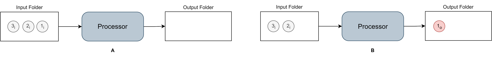

-   [GSProcessor](#gsprocessor)
    -   [Introduction](#introduction)
    -   [Installation](#installation)
    -   [Launch a Processor](#launch-a-processor)
    -   [Execute a task](#execute-a-task)

<!-- README.md is generated from README.Rmd. Please edit that file -->

# GSProcessor

<!-- badges: start -->
<!-- badges: end -->

GEN-RWD Sandbox Processor (**GSProcessor**) is the R package for the
Processor module of the GEN-RWD Sandbox architecture[1].

## Introduction

The Processor is the module responsible for executing analytics tasks
according to a black box model that relies on a minimal structure. This
structure comprises a token, an input folder, the processing unit, and
an output folder.



The Processor monitors one or more input folders, and upon the post of a
token into an input folder, it processes and executes the script
contained within the token (**Figure A**). The Processor then reports
the result of the execution to the designated output folder in the form
of a new token (**Figure** **B**).

A **token** contains the details of the task to be executed and is
designed as a collection of zipped files, including at least one XML
file that characterizes and describes the task run and the contents of
the token itself, referred to as a descriptor. A token can contain both
the data and the script file or information about their location within
a local repository.

## Installation

You can install the development version of GSProcessor like so:

``` r
# FILL THIS IN! HOW CAN PEOPLE INSTALL YOUR DEV PACKAGE?
```

## Launch a Processor

To instantiate a Processor create a *bckGndProcessor* object and run its
*start()* function, using the following code:

``` r
library(GSProcessor)
library(jsonlite)
library(XML)
library(stringr)
library(zip)


objS <- bckGndProcessor(input_folder.dir = "./inputFolder/",
                        output_folder.dir = "./outputFolder/",
                        tmp_folder.dir = "./tmpFolder/",
                        sync_folder.dir = "./syncFolder/",
                        override.repeated.tUID = TRUE
)

objS$start()
```

## Execute a task

To execute a task a token must be put in the input folder of the
Processor.

As an example try to drop the testToken zip file into your Processor
input folder.

[1] Paper CIBB Reference
